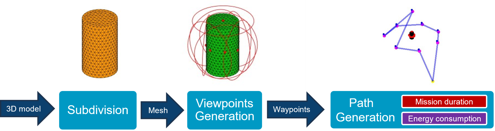

This repository contains matlab code for the IRP: "UAV Flight Planning Around Known Structures for Structural Inspections" with Marshall Futureworx carried out at Cranfield University in 2024. The purpose of this is to ensure 100% coverage of a target structure 

