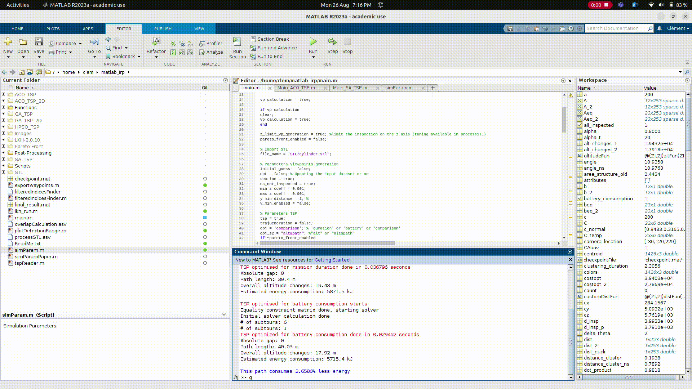

# UAV Flight Planning Around Known Structures for Structural Inspections

This repository contains matlab code for the IRP: "UAV Flight Planning Around Known Structures for Structural Inspections" with Marshall Futureworx carried out at Cranfield University in 2024. The purpose of this is to ensure 100% coverage of a target structure. The next figure shows the overview of the provided code. Validation using PX4 SITL, Gazebo Garden and ROS2 humble is provided at : https://github.com/Clems78/uav_structural_inspection_ros_pkg.

# 1. Pre-Processing
   
The input of the Viewpoints Generation (VG) algorithm is an stl file that should be meshed (max elements size = 200mm). gmsh (https://gmsh.info/) can be used for that. Some stl file already meshed are available in the repository.

# 2. Viewpoints Generation

Using k-medoids clustering, viewpoints are generated. A few parameters can be changed in the SimParam.m file:

